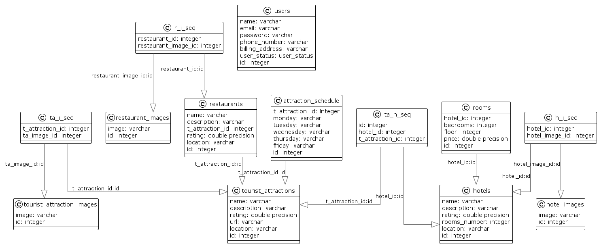
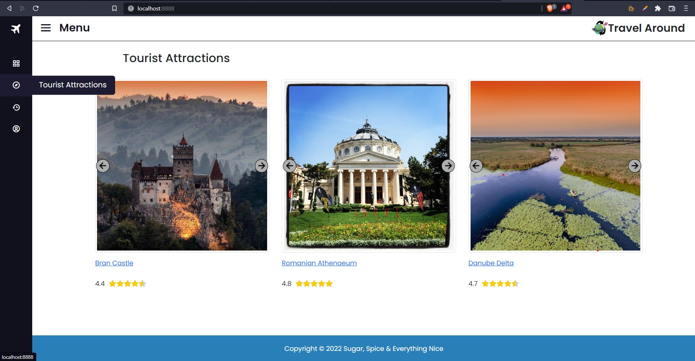
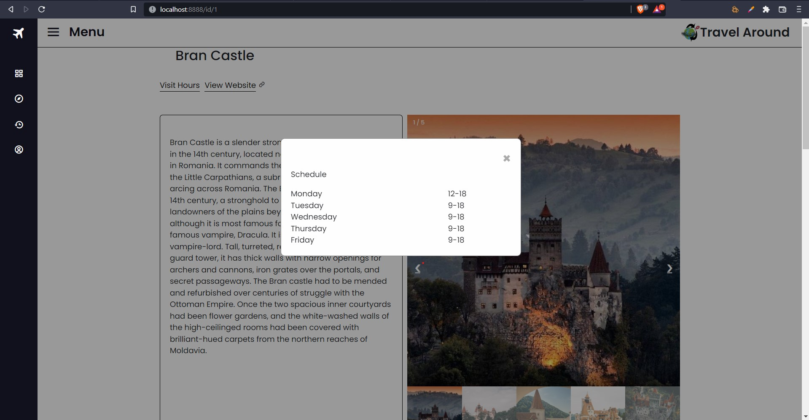
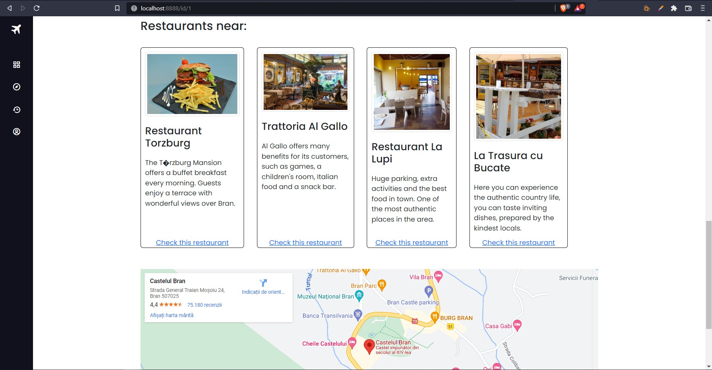
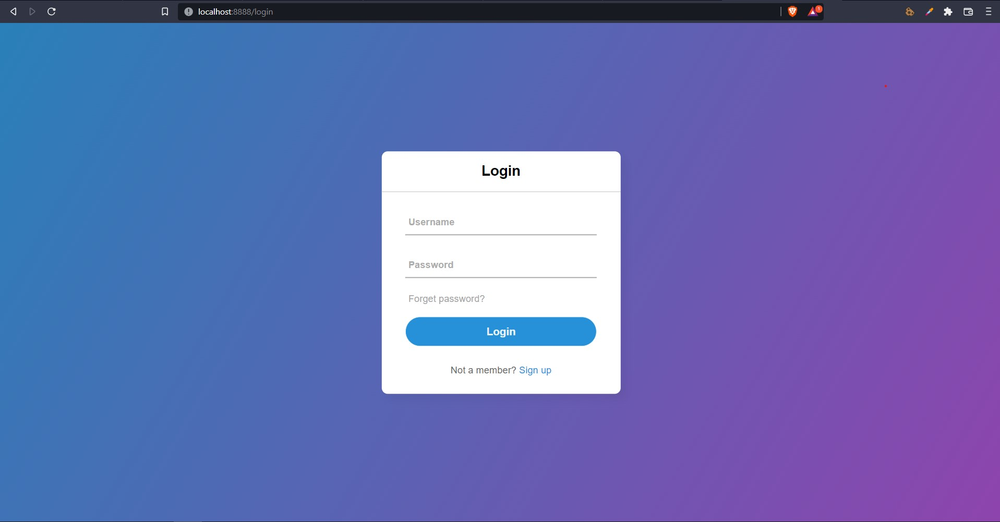
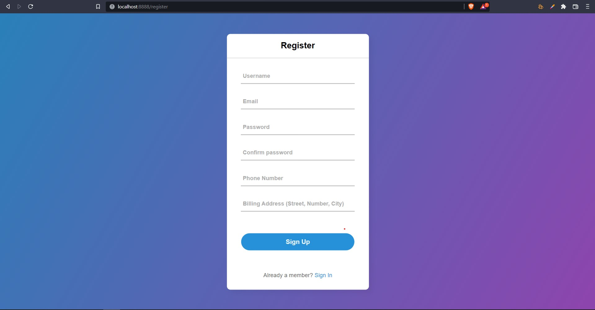

# Travel Around

> ### Travel Around is a service which offers everybody a well-organized website filled with Romanian Tourist Attractions, well rated Hotels and Restaurants in the surroundings.
Travel Around was created to demonstrate a good understanging about basics of Java Web Applications, built with WebServlets including CRUD operations, authentication and more.

## About functionalities
- Authentication using jdbc and PostgreSQL
- CRUD Operations
- Google Maps
- Thymeleaf templates

## PostgreSQL Schema
Using JDBC, DAO and MVC architecture, the schema looks as follows:

## Getting started
### Backend
Make sure you have [Maven (Windows)](https://www.educba.com/install-maven/) or [Maven (Linux)](https://www.journaldev.com/33588/install-maven-linux-ubuntu) install.
Open the project by right-click the pom.xml and selecting your favorite editor (might take a minute for the dependencies to install).

### Frontend
For frontend you don't need to do anything. In the project, there is a ThymeleafConfigurer who does the job for you.

### Database
Travel Around uses PostrgreSQL database integrated with JDBC. To connect to the database locally, please insert in `db.properties` the following fields:
1. user -> your database username *(eg: postgresuser)*
2. password -> your database password *(eg: 1234)*
3. database -> your database name *(eg: mydatabase)*

## Functionality overview
### General page breakdown
- Home Page (URL: /)
	- Header: Menu button for sidebar, logo.
	- Sidebar: Extensible on click, showing preview of what icons mean.
	- Image carousels presenting different pictures of attractions.
	- Their name and rating using star model under each carousel.

- Register/Login (URLs: /register, /login)
	- The user needs to fill the fields: Username, Email Address, Password, Password confirmation, Phone number and Billing Address on Register page.
	- The user logs in in using the account just created on Login page.

- Tourist Attraction details (URL: /id/?)
	- Modal with visit schedule, link to the main website (if exists)
	- Description, another carousel with the images
	- Hotels and Restaurants near with short description and link.
	- Location using Google Maps.

- Hotel/Restaurant details (URL: /id/?/hotel/?, /id/?/restaurant/?)
	- Just pictures.

### Screenshots

